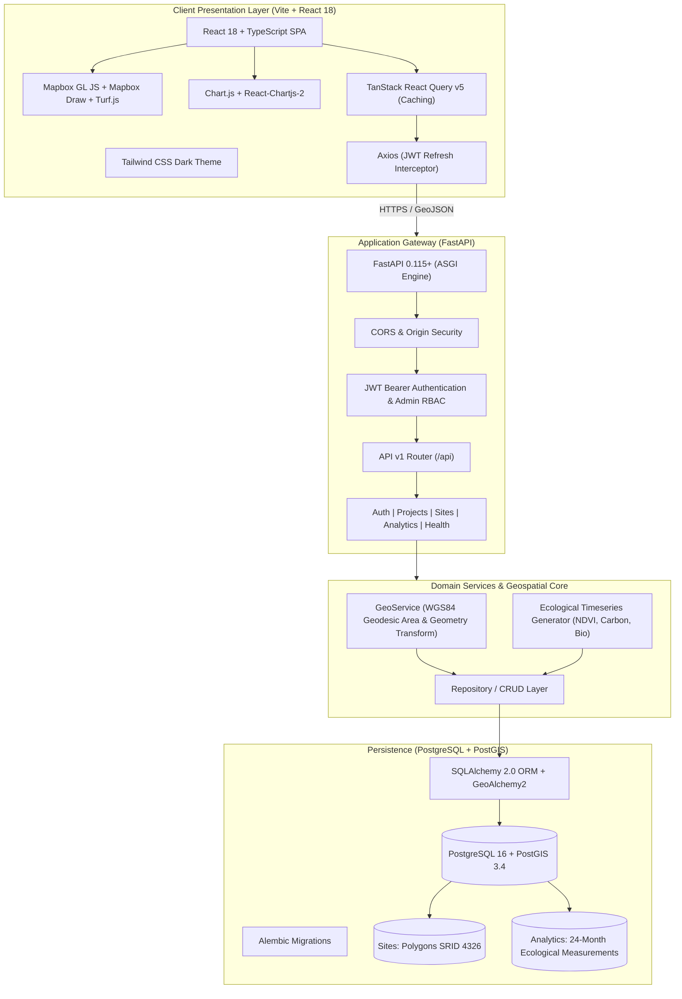

# 🌳 Darukaa.Earth — Geospatial Carbon & Biodiversity Analytics Platform

[](https://github.com/darukaa-earth/platform)
[](https://github.com/darukaa-earth/platform)
[](LICENSE)
[](https://www.python.org/)
[](https://nodejs.org/)
[](https://postgis.net/)

> Production-grade full-stack geospatial intelligence platform engineered for monitoring, managing, and visualizing nature-based carbon sequestration and biodiversity projects worldwide.

---

## 🌟 Business Overview & Core User Stories

1. **Administrator Authentication**: Secure JWT-based login and registration with bcrypt password hashing and token rotation.
2. **Project Management**: Create, edit, and organize nature initiatives across tropical rainforests, mangroves, peatlands, temperate woodlands, and savannahs.
3. **Geographical Sites**: Add multiple sites with PostGIS polygon spatial boundaries (SRID 4326).
4. **Interactive Mapbox Drawing**: Draw polygons on an interactive map, edit vertices, calculate geodesic surface area in hectares in real-time, and persist to database.
5. **GIS Explorer**: View all portfolio projects and site boundaries on an interactive vector/satellite map.
6. **Deep Dive Site Analytics**: Click any site parcel to inspect 24-month historical trends in Carbon Density (tCO2e/ha), Biodiversity Health Score (0-100), and Remote Sensing Vegetation Index (NDVI).
7. **Executive Visualizations**: High-performance interactive Line, Bar, Area, and Doughnut charts built with Chart.js.

---

## 📐 Architecture Diagram



---

## 🛠 Tech Stack

| Layer | Technologies |
| :--- | :--- |
| **Frontend** | React 18, Vite, TypeScript, Tailwind CSS, Mapbox GL JS, Mapbox GL Draw, Turf.js, TanStack React Query v5, Axios, Chart.js, React-Chartjs-2, Lucide Icons |
| **Backend** | Python 3.12+, FastAPI, SQLAlchemy 2.0, GeoAlchemy2, PostGIS, PyJWT, Bcrypt, Pydantic v2, Alembic Migrations |
| **Database** | PostgreSQL 16 with PostGIS 3.4 Spatial Extension |
| **DevOps & Containers**| Docker, Multi-Stage Dockerfiles, Docker Compose |
| **Testing** | Backend: Pytest, HTTPX; Frontend: Vitest, React Testing Library, JSDOM |
| **Code Quality** | Ruff, Black, isort, mypy, ESLint, Prettier, Husky, lint-staged |
| **CI/CD** | GitHub Actions (Frontend CI, Backend CI, Multi-cloud Deploy) |
| **Cloud Deployment** | Render (FastAPI + PostGIS), Vercel (React Vite SPA) |

---

## 🚀 Quick Start (Docker Compose)

The fastest way to launch the complete system (PostGIS Database + FastAPI Backend + React Frontend) is with Docker Compose:

```bash
# 1. Clone the repository
git clone https://github.com/darukaa-earth/platform.git
cd platform

# 2. Configure environment (optional, defaults provided)
cp .env.example .env

# 3. Spin up all services
docker compose up --build -d
```

### Access URLs:
- **Frontend Dashboard**: [http://localhost:5173](http://localhost:5173)
- **FastAPI Backend**: [http://localhost:8000](http://localhost:8000)
- **Interactive OpenAPI Documentation**: [http://localhost:8000/api/docs](http://localhost:8000/api/docs)
- **Health Check**: [http://localhost:8000/api/health](http://localhost:8000/api/health)

### Default Administrator Credentials:
- **Email**: `admin@darukaa.earth`
- **Password**: `AdminPass123!`
*(Or click the "Fill Default Admin Credentials" button on the login screen).*

---

## 💻 Local Development Setup

### 1. Backend Setup

```bash
cd backend

# Create and activate virtual environment
python -m venv venv
# On Windows:
.\venv\Scripts\activate
# On macOS/Linux:
source venv/bin/activate

# Install dependencies
pip install -r requirements.txt
pip install -r requirements-dev.txt

# Run migrations
alembic upgrade head

# Start FastAPI dev server with auto-reload
uvicorn app.main:app --reload --port 8000
```

### 2. Frontend Setup

```bash
cd frontend

# Install npm dependencies
npm install

# Start Vite dev server
npm run dev
```

---

## 🧪 Testing

### Backend Unit & Integration Tests (Pytest)
```bash
cd backend
python -m pytest
```
*Tests cover JWT authentication, duplicate registration handling, project CRUD, GeoJSON polygon serialization, area calculations, and timeseries analytics.*

### Frontend Tests (Vitest + React Testing Library)
```bash
cd frontend
npm run test:run
```

---

## 🗺 Interactive Map Features

- **Mapbox GL JS** with vector satellite imagery and Carto Dark fallback tiles if no token is initially provided.
- **Draw Polygon**: Click polygon tool (top-left) to draw parcels directly on the map.
- **Geodesic Area Calculation**: Computes surface area in hectares using `@turf/turf` in real-time.
- **Save As Site**: Persists the drawn polygon directly into PostGIS via `/api/sites` and automatically initializes 24 months of synthetic ecological timeseries.
- **Popups**: Click any saved site to display a popup with latest carbon density, biodiversity score, NDVI, and an instant link to deep dive analytics.

---

## 📊 Analytics Dashboard Visualizations

- **Carbon Trend Line & Area Chart**: Tracks historical carbon sequestration (tCO2e/ha) over 24 months.
- **Biodiversity Health Index Chart**: Tracks species richness and Shannon index progress (0 - 100).
- **Vegetation Density Index (NDVI)**: Seasonal canopy vigor (-1.0 to 1.0).
- **Site Comparison Bar Chart**: Compare carbon, biodiversity, or land area across all sites.
- **Ecosystem Classification Doughnut Chart**: Displays land area breakdown by biomes (Rainforest, Mangrove, Peatland, Temperate, Savannah).

---

## 📡 API Reference Overview

| Method | Endpoint | Description | Role |
| :--- | :--- | :--- | :--- |
| `POST` | `/api/auth/register` | Register administrator user | Public |
| `POST` | `/api/auth/login` | Authenticate & obtain access/refresh tokens | Public |
| `POST` | `/api/auth/refresh` | Exchange refresh token for new access token | Public |
| `GET` | `/api/auth/me` | Fetch authenticated profile | Authenticated |
| `GET` | `/api/projects` | List projects with aggregate summaries | Authenticated |
| `POST` | `/api/projects` | Create a new project | Admin |
| `GET` | `/api/projects/:id` | Get project details and child sites | Authenticated |
| `PUT` | `/api/projects/:id` | Update project name or description | Admin |
| `DELETE`| `/api/projects/:id` | Cascade delete project and child sites | Admin |
| `GET` | `/api/sites` | List sites (supports `format=geojson`) | Authenticated |
| `POST` | `/api/sites` | Create site with GeoJSON Polygon boundary | Admin |
| `GET` | `/api/sites/:id` | Get site details and latest metrics | Authenticated |
| `PUT` | `/api/sites/:id` | Update site name, status, or geometry | Admin |
| `DELETE`| `/api/sites/:id` | Delete site and timeseries records | Admin |
| `GET` | `/api/analytics/overview`| Platform-wide summary KPIs | Authenticated |
| `GET` | `/api/analytics/site/:id`| 24-month ecological timeseries | Authenticated |
| `GET` | `/api/analytics/project/:id`| Project aggregate trends & comparisons | Authenticated |
| `POST` | `/api/analytics/seed` | Seed realistic nature conservation datasets | Admin |
| `GET` | `/api/health` | Service and database health check | Public |

A complete Postman Collection is provided in [`docs/darukaa_earth.postman_collection.json`](docs/darukaa_earth.postman_collection.json).

---

## 🔒 Security & Code Quality

- **Git Hooks**: Pre-commit hooks verify linting and formatting via Husky & `lint-staged`.
- **Python Quality**: Enforced via `ruff`, `black`, `isort`, and `mypy`.
- **TypeScript Quality**: Strict type checks (`tsc --noEmit`) and ESLint.
- **SQL Injection Protection**: Fully parameterized queries via SQLAlchemy 2.0 ORM.
- **CORS Protection**: Whitelisted origin headers.

---

## 📄 License

Darukaa.Earth is released under the [MIT License](LICENSE).
