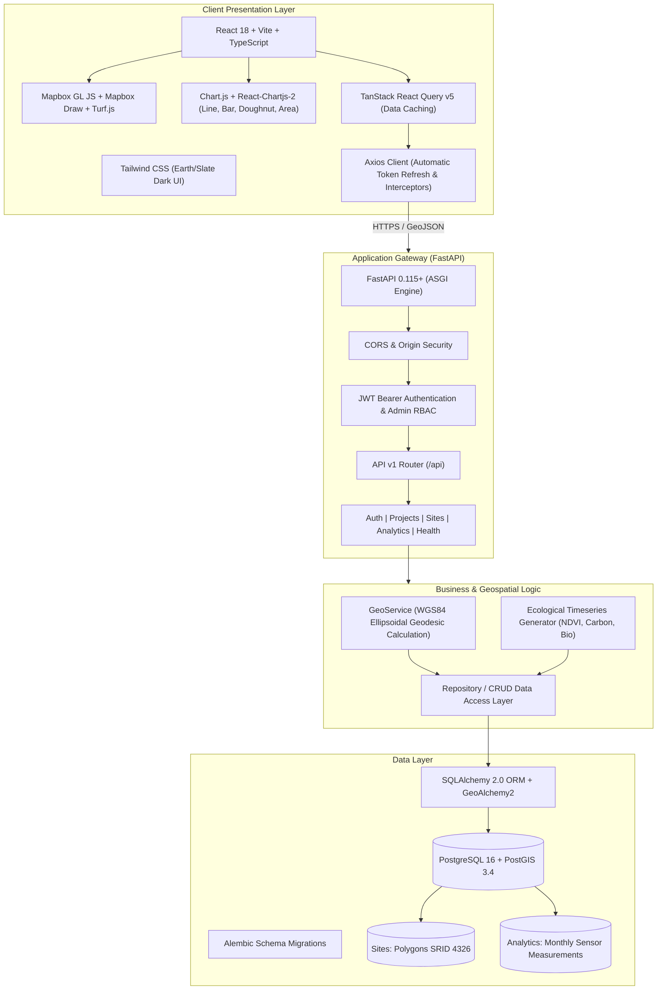

# Darukaa.Earth Platform Architecture

## System Architecture

Darukaa.Earth is an enterprise-grade full-stack geospatial intelligence platform engineered for nature-based carbon sequestration and biodiversity monitoring projects.

---

## Geospatial Processing Pipeline

1. **Polygon Boundary Ingestion**:
   - Polygons are drawn in the browser using `@mapbox/mapbox-gl-draw`.
   - The boundary vertices are sent as RFC 7946 standard GeoJSON `Polygon`.
2. **Server-Side Geodesic Calculation**:
   - `GeoService.calculate_polygon_area_hectares` calculates true surface area on the WGS84 ellipsoid.
   - Converts GeoJSON to Well-Known Text (`POLYGON((lng lat, ...))`) for PostGIS spatial indexing.
3. **Optimized GeoJSON Serialization**:
   - Both native spatial geometry (for SQL spatial joins) and cached GeoJSON representations are maintained.
   - Mapbox GL JS can consume `/api/sites?format=geojson` directly as a native vector/GeoJSON source.

---

## Security Architecture

- **Password Hashing**: Bcrypt with salted cryptographic rounds.
- **Access Tokens**: Short-lived JWT (60 mins) containing user UUID and role claims.
- **Refresh Tokens**: Long-lived JWT (7 days) exchanged securely via `/api/auth/refresh`.
- **Role-Based Access Control**:
  - `admin`: Project creation, editing, deletion, site creation/updating, data seeding.
  - `user` / `viewer`: Read-only telemetry, map exploration, chart inspection.
- **CORS Protection**: Restricted to configured origins.
